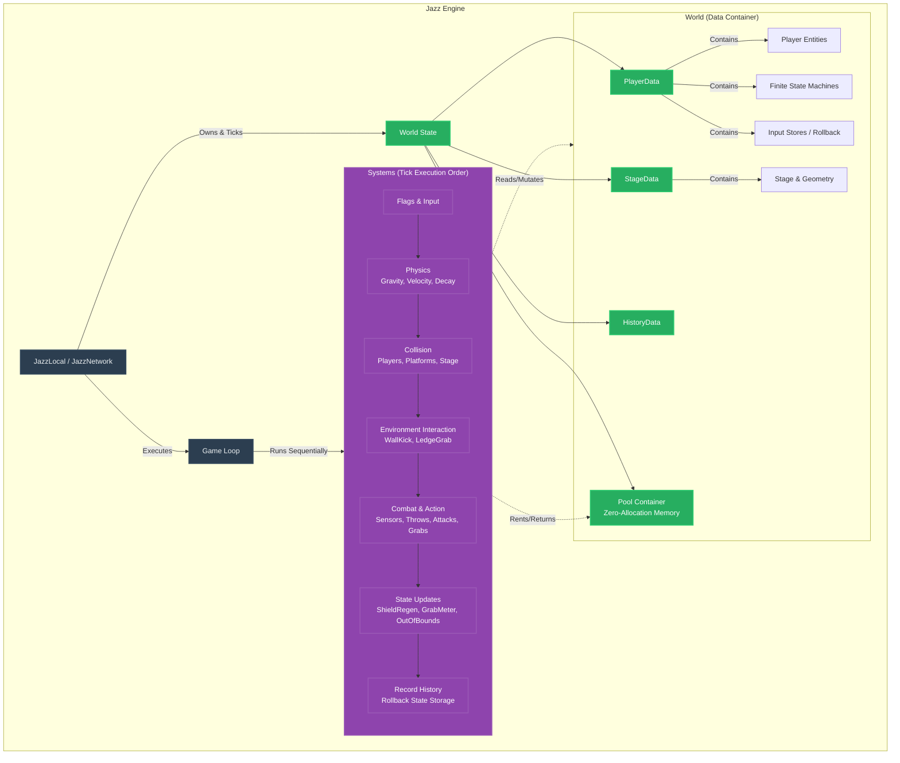

# Jazz Engine Architecture

Here is the updated systems architecture diagram for the Jazz Engine, reflecting the current state of the codebase.

```mermaid
graph TD
    subgraph Engine["Jazz Engine"]
        Core[JazzLocal / JazzNetwork] -->|Owns & Ticks| World[World State]
        Core -->|Executes| GameLoop[Game Loop]
        
        subgraph WorldState["World (Data Container)"]
            direction TB
            PD[PlayerData]
            SD[StageData]
            HD[HistoryData]
            Pools[Pool Container<br>Zero-Allocation Memory]
            
            PD -->|Contains| Players[Player Entities]
            PD -->|Contains| FSM[Finite State Machines]
            PD -->|Contains| Input[Input Stores / Rollback]
            SD -->|Contains| Stages[Stage & Geometry]
        end
        
        World --> PD
        World --> SD
        World --> HD
        World --> Pools
        
        subgraph Systems["Systems (Tick Execution Order)"]
            direction TB
            S1[Flags & Input]
            S2[Physics<br>Gravity, Velocity, Decay]
            S3[Collision<br>Players, Platforms, Stage]
            S4[Environment Interaction<br>WallKick, LedgeGrab]
            S5[Combat & Action<br>Sensors, Throws, Attacks, Grabs]
            S6[State Updates<br>ShieldRegen, GrabMeter, OutOfBounds]
            S7[Record History<br>Rollback State Storage]
            
            S1 --> S2 --> S3 --> S4 --> S5 --> S6 --> S7
        end
        
        GameLoop -->|Runs Sequentially| Systems
        Systems -.->|Reads/Mutates| WorldState
        Systems -.->|Rents/Returns| Pools
    end

    classDef core fill:#2c3e50,stroke:#34495e,stroke-width:2px,color:#ecf0f1;
    classDef data fill:#27ae60,stroke:#2ecc71,stroke-width:2px,color:#fff;
    classDef system fill:#8e44ad,stroke:#9b59b6,stroke-width:2px,color:#fff;
    
    class Core,GameLoop core;
    class World,PD,SD,HD,Pools data;
    class Systems,S1,S2,S3,S4,S5,S6,S7 system;
```
