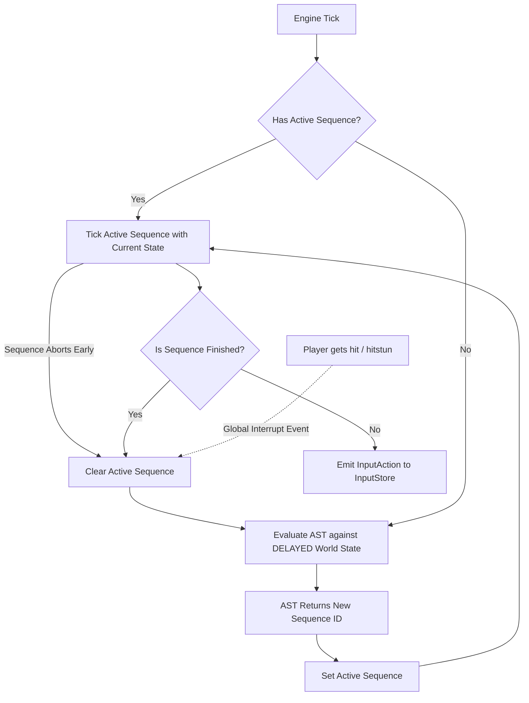

# Generic CPU Player AST Architecture

This spec outlines the design for a zero-allocation, deterministic Abstract Syntax Tree (AST) that drives AI players in the platform fighter engine.

## Architecture Overview

The system uses a **Hybrid Macro-AST approach**:
1. **Evaluation**: The AST evaluates the `World` state deterministically without generating garbage.
2. **Decision**: The root evaluation resolves to a **Sequence ID** (a macro of inputs, like a Wavedash, Dash Attack, or Recovery).
3. **Execution**: A `CpuController` ticks the active Sequence every frame, emitting raw `InputAction`s into the engine until the Sequence is complete or interrupted.

### Advanced Design Constraints
1. **Simulated Reaction Time**: To avoid 1-frame "TAS-bot" reaction times, the AST does not evaluate the *current* frame's state. It evaluates a historical state from `N` frames ago using `World.HistoryData`.
2. **Self-Aborting Sequences**: Sequences are not entirely blind. They can inspect the current world state during their `Tick()` and abort early (`isDone: true`) if their tactical goal is no longer viable.
3. **Deterministic Mix-Ups**: To prevent predictable behavior loops, the AST will utilize weighted random selectors tied to a deterministic PRNG (seeded by the engine state) to choose varied approaches.

## Execution Flow



## Core Interfaces (Pseudo-Code)

### 1. AST Nodes
All nodes evaluate synchronously and do not allocate memory. They traverse down the tree until an Action Node returns a Sequence ID.

```typescript
type SequenceId = number;

interface IAstNode {
  // Returns a Sequence ID to execute, or undefined if this branch fails
  Evaluate(world: World, player: Player): SequenceId | undefined;
}

// Example Condition Node: Checks if opponent is close
class Node_IsOpponentInThreatZone implements IAstNode {
  constructor(private childNode: IAstNode) {}

  Evaluate(world: World, player: Player): SequenceId | undefined {
    // Zero-allocation distance check
    const opponent = world.PlayerData.GetPlayer(GetEnemyId(player.ID)); 
    const dist = Math.abs(player.Physics.Pos.X - opponent.Physics.Pos.X);
    
    if (dist < NumberToRaw(50)) { // Using fixed-point math
      return this.childNode.Evaluate(world, player);
    }
    return undefined;
  }
}
```

### 2. Sequences (Macros)
Instead of allocating arrays of inputs dynamically, we use a fixed tick function to yield inputs over time. 

```typescript
interface IActionSequence {
  // Returns the input action for the current frame.
  // The sequence can inspect the CURRENT world state and self-abort (isDone: true) early.
  Tick(frameIndex: number, world: World, player: Player): { input: InputAction, isDone: boolean };
}

// Example: Wavedash Sequence
class Seq_Wavedash implements IActionSequence {
  Tick(frameIndex: number, world: World, player: Player) {
    // Example of self-aborting: if we accidentally walked off the ledge, abort the wavedash
    if (player.FSMInfo.CurrentState === STATE_IDS.FALL_S) {
       return { input: CreateInput(IDLE), isDone: true };
    }

    if (frameIndex === 0) return { input: CreateInput(JUMP), isDone: false };
    if (frameIndex === 3) return { input: CreateInput(AIR_DODGE_DOWN_DIAG), isDone: false };
    if (frameIndex > 14) return { input: CreateInput(IDLE), isDone: true };
    return { input: CreateInput(IDLE), isDone: false };
  }
}
```

### 3. The CPU Controller
The component that glues it together and sits in the game loop right before inputs are processed.

```typescript
class CpuController {
  ActiveSequence: SequenceId | undefined = undefined;
  SequenceFrame: number = 0;
  AstRoot: IAstNode;
  ReactionDelayFrames: number = 12; // e.g., ~200ms reaction time at 60fps

  constructor(astRoot: IAstNode) {
    this.AstRoot = astRoot;
  }

  // Called every engine frame to determine the CPU's input
  Update(world: World, player: Player): InputAction {
    // 1. Check for global interruptions (e.g. we got hit)
    if (player.FSMInfo.CurrentState === STATE_IDS.HITSTUN_S) {
       this.ActiveSequence = undefined;
    }

    // 2. Evaluate AST if we don't have an active sequence
    if (this.ActiveSequence === undefined) {
      // Feeds the AST a delayed world state to simulate reaction time
      // (Implementation requires a way to fetch state from world.HistoryData)
      const delayedState = GetHistoricalWorldState(world, this.ReactionDelayFrames);
      this.ActiveSequence = this.AstRoot.Evaluate(delayedState, player);
      this.SequenceFrame = 0;
    }

    // 3. Execute plan
    if (this.ActiveSequence !== undefined) {
      const sequenceDef = SequenceLibrary.Get(this.ActiveSequence);
      // We pass the CURRENT world state to the Sequence tick so it can self-abort if things go wrong
      const result = sequenceDef.Tick(this.SequenceFrame, world, player);
      
      this.SequenceFrame++;
      if (result.isDone) {
        this.ActiveSequence = undefined;
      }
      return result.input;
    }

    // 4. Default fallback
    return CreateInput(IDLE);
  }
}
```

## User Review Required

> [!IMPORTANT]  
> **1. InputAction Allocation:** Since `InputAction` objects shouldn't be allocated per-frame, we will likely need to pre-allocate an `InputAction` inside the `CpuController` and mutate it during `Tick()`, rather than returning a newly created object. Does this align with your zero-allocation pattern?
>
> **2. Historical State Fetching:** To implement the reaction delay, we need a fast, zero-allocation way to query player positions/state from `N` frames ago. Does `world.HistoryData` currently support querying past frames efficiently for AI evaluation?

## Proposed Changes

Create a new module for the AI system:
#### [NEW] `game/engine/ai/astNode.ts`
Base interfaces for nodes.
#### [NEW] `game/engine/ai/sequence.ts`
Base interfaces and library for Sequences.
#### [NEW] `game/engine/ai/cpuController.ts`
The controller that manages the active sequence and evaluates the AST.
#### [NEW] `game/engine/ai/nodes/`
Directory for specific implementations of condition and action nodes.

## Verification Plan
1. Compile the new TypeScript files ensuring no type errors.
2. Write a Jest test where a dummy `CpuController` is ticked over 20 frames to verify it transitions states correctly, emits a multi-frame sequence, and can be interrupted by a hitstun state.
