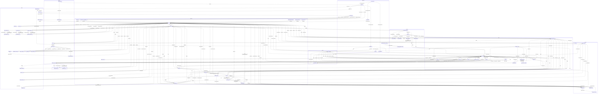

# Jazz Engine Player FSM

```mermaid
stateDiagram-v2
    state Movement {
        IDLE_S
        WALK_S
        TURN_S
        DASH_S
        DASH_TURN_S
        RUN_S
        RUN_TURN_S
        STOP_RUN_S
        CROUCH_S
        WALL_KICK_S
        GETUP_S
        GETUP_ROLL_FORWARD_S
        GETUP_ROLL_BACK_S
        TECH_IN_PLACE_S
        ROLL_TECH_S
    }
    state Aerial {
        JUMP_SQUAT_S
        JUMP_S
        N_FALL_S
        AIR_DODGE_S
        HELPLESS_S
        N_AIR_S
        F_AIR_S
        U_AIR_S
        B_AIR_S
        D_AIR_S
        SIDE_SPCL_AIR_S
        SIDE_SPCL_EX_AIR_S
        DOWN_SPCL_AIR_S
    }
    state Landing {
        LAND_S
        SOFT_LAND_S
    }
    state Grabbing {
        LEDGE_GRAB_S
        GRAB_S
        GRAB_HOLD_S
        GRAB_HELD_S
        GRAB_RELEASE_S
        GRAB_ESCAPE_S
    }
    state Ledge {
        LEDGE_GETUP_S
        LEDGE_ROLL_S
    }
    state Attacks {
        LEDGE_ATTACK_S
        ATTACK_S
        DASH_ATTACK_S
        DOWN_TILT_S
        SIDE_TILT_S
        UP_TILT_S
        SIDE_CHARGE_S
        SIDE_CHARGE_EX_S
        UP_CHARGE_S
        UP_CHARGE_EX_S
        DOWN_CHARGE_S
        DOWN_CHARGE_EX_S
        PUMMEL_S
        GETUP_ATTACK_S
        FORWARD_THROW_S
        BACK_THROW_S
        UP_THROW_S
        DOWN_THROW_S
        GRND_SLAM_S
        WALL_SLAM_S
    }
    state HitReaction {
        HIT_STOP_S
        LAUNCH_S
        TUMBLE_S
        SHIELD_BREAK_TUMBLE_S
        DIZZY_S
        HIT_SLIDE_S
        HIT_FLINCH_S
        DIRT_NAP_S
    }
    state Defensive {
        SHIELD_RAISE_S
        SHIELD_S
        SPOT_DODGE_S
        ROLL_DODGE_S
        SHIELD_DROP_S
        SHIELD_BREAK_S
        SHIELD_BREAK_LAND_S
    }
    state Specials {
        SPCL_S
        SIDE_SPCL_S
        SIDE_SPCL_EX_S
        DOWN_SPCL_S
        UP_SPCL_S
    }
    IDLE_S --> WALK_S : MOVE
    IDLE_S --> JUMP_SQUAT_S : JUMP
    IDLE_S --> N_FALL_S : FALL
    IDLE_S --> CROUCH_S : DOWN
    IDLE_S --> SHIELD_RAISE_S : GUARD
    IDLE_S --> GRAB_S : GRAB
    IDLE_S --> DASH_S : cond IdleToDash
    IDLE_S --> DASH_TURN_S : cond IdleToTurnDash
    IDLE_S --> TURN_S : cond IdleToTurn
    IDLE_S --> ATTACK_S : cond IdleToAttack
    IDLE_S --> SIDE_CHARGE_S : cond ToSideCharge
    IDLE_S --> UP_CHARGE_S : cond ToUpCharge
    IDLE_S --> UP_TILT_S : cond IdleToUpTilt
    IDLE_S --> DOWN_CHARGE_S : cond ToDownCharge
    IDLE_S --> SPCL_S : cond ToNSpecial
    IDLE_S --> SIDE_SPCL_S : cond ToSideSpecial
    IDLE_S --> DOWN_SPCL_S : cond ToDownSpecial
    IDLE_S --> UP_SPCL_S : cond ToUpSpecial
    IDLE_S --> JUMP_SQUAT_S : cond StickJump
    WALK_S --> IDLE_S : IDLE
    WALK_S --> JUMP_SQUAT_S : JUMP
    WALK_S --> CROUCH_S : DOWN
    WALK_S --> SHIELD_RAISE_S : GUARD
    WALK_S --> GRAB_S : GRAB
    WALK_S --> TURN_S : cond WalkToTurn
    WALK_S --> DASH_S : cond WalkToDash
    WALK_S --> SIDE_SPCL_S : cond ToSideSpecial
    WALK_S --> SIDE_CHARGE_S : cond ToSideCharge
    WALK_S --> DOWN_CHARGE_S : cond ToDownCharge
    WALK_S --> UP_CHARGE_S : cond ToUpCharge
    WALK_S --> SIDE_TILT_S : cond ToSideTilt
    WALK_S --> JUMP_SQUAT_S : cond StickJump
    TURN_S --> JUMP_SQUAT_S : JUMP
    TURN_S --> DASH_S : cond TurnToDash
    TURN_S --> SIDE_SPCL_S : cond ToSideSpecial
    TURN_S --> SIDE_TILT_S : cond ToSideTilt
    TURN_S --> WALK_S : default TurnDefaultWalk
    TURN_S --> IDLE_S : default Idle
    TURN_S --> SIDE_SPCL_S : default ToSideSpecial
    DASH_S --> JUMP_SQUAT_S : JUMP
    DASH_S --> N_FALL_S : FALL
    DASH_S --> DASH_TURN_S : cond DashToTurn
    DASH_S --> SIDE_SPCL_S : cond ToSideSpecial
    DASH_S --> UP_SPCL_S : cond ToUpSpecial
    DASH_S --> DASH_ATTACK_S : cond ToDashAttack
    DASH_S --> JUMP_SQUAT_S : cond StickJump
    DASH_S --> RUN_S : default DashDefaultRun
    DASH_S --> IDLE_S : default Idle
    DASH_TURN_S --> JUMP_SQUAT_S : JUMP
    DASH_TURN_S --> SIDE_SPCL_S : cond ToSideSpecial
    DASH_TURN_S --> JUMP_SQUAT_S : cond StickJump
    DASH_TURN_S --> DASH_S : default Dash
    RUN_S --> JUMP_SQUAT_S : JUMP
    RUN_S --> STOP_RUN_S : IDLE
    RUN_S --> N_FALL_S : FALL
    RUN_S --> CROUCH_S : DOWN
    RUN_S --> RUN_TURN_S : cond RunToTurn
    RUN_S --> SIDE_SPCL_S : cond ToSideSpecial
    RUN_S --> UP_SPCL_S : cond ToUpSpecial
    RUN_S --> DASH_ATTACK_S : cond ToDashAttack
    RUN_S --> STOP_RUN_S : cond RunToRunStopByGuard
    RUN_S --> JUMP_SQUAT_S : cond StickJump
    RUN_TURN_S --> JUMP_SQUAT_S : JUMP
    RUN_TURN_S --> SIDE_SPCL_S : cond ToSideSpecial
    RUN_TURN_S --> UP_SPCL_S : cond ToUpSpecial
    RUN_TURN_S --> IDLE_S : default DefaultTrunRunToIdle
    RUN_TURN_S --> RUN_S : default Run
    STOP_RUN_S --> DASH_S : MOVE_FAST
    STOP_RUN_S --> JUMP_SQUAT_S : JUMP
    STOP_RUN_S --> N_FALL_S : FALL
    STOP_RUN_S --> CROUCH_S : DOWN
    STOP_RUN_S --> SIDE_SPCL_S : SIDE_SPCL
    STOP_RUN_S --> RUN_TURN_S : cond RunStopToTurn
    STOP_RUN_S --> UP_SPCL_S : cond ToUpSpecial
    STOP_RUN_S --> IDLE_S : default Idle
    JUMP_SQUAT_S --> GRAB_S : GRAB
    JUMP_SQUAT_S --> UP_SPCL_S : cond ToUpSpecial
    JUMP_SQUAT_S --> JUMP_S : default Jump
    JUMP_S --> JUMP_S : cond ToJump
    JUMP_S --> AIR_DODGE_S : cond ToAirDodge
    JUMP_S --> JUMP_S : cond StickJump
    JUMP_S --> N_FALL_S : default NFall
    N_FALL_S --> LAND_S : LAND
    N_FALL_S --> SOFT_LAND_S : SOFT_LAND
    N_FALL_S --> LEDGE_GRAB_S : LEDGE_GRAB
    N_FALL_S --> WALL_KICK_S : WALL_KICK
    N_FALL_S --> JUMP_S : cond ToJump
    N_FALL_S --> AIR_DODGE_S : cond ToAirDodge
    N_FALL_S --> N_AIR_S : cond ToNAir
    N_FALL_S --> U_AIR_S : cond ToUAir
    N_FALL_S --> D_AIR_S : cond ToDAir
    N_FALL_S --> F_AIR_S : cond ToFAir
    N_FALL_S --> B_AIR_S : cond ToBAir
    N_FALL_S --> SIDE_SPCL_AIR_S : cond ToSideSpecialAir
    N_FALL_S --> UP_SPCL_S : cond ToUpSpecial
    N_FALL_S --> DOWN_SPCL_AIR_S : cond ToDownSpecialAir
    N_FALL_S --> JUMP_S : cond StickJump
    LAND_S --> N_FALL_S : FALL
    LAND_S --> IDLE_S : default LandToIdle
    LAND_S --> WALK_S : default LandToWalk
    LAND_S --> TURN_S : default LandToTurn
    SOFT_LAND_S --> N_FALL_S : FALL
    SOFT_LAND_S --> IDLE_S : default LandToIdle
    SOFT_LAND_S --> WALK_S : default LandToWalk
    SOFT_LAND_S --> TURN_S : default LandToTurn
    LEDGE_GRAB_S --> LEDGE_GETUP_S : JUMP
    LEDGE_GRAB_S --> LEDGE_ATTACK_S : ATTACK
    LEDGE_GRAB_S --> N_FALL_S : cond LedgeGrabDrop
    LEDGE_GRAB_S --> LEDGE_GETUP_S : cond LedgeGrabToGetUp
    LEDGE_GRAB_S --> LEDGE_ROLL_S : cond LedgeGrabToLedgeRoll
    LEDGE_GRAB_S --> N_FALL_S : default NFall
    LEDGE_GETUP_S --> IDLE_S : default Idle
    LEDGE_ATTACK_S --> IDLE_S : default Idle
    LEDGE_ROLL_S --> IDLE_S : default Idle
    AIR_DODGE_S --> LAND_S : LAND
    AIR_DODGE_S --> LAND_S : SOFT_LAND
    AIR_DODGE_S --> HELPLESS_S : default Helpless
    HELPLESS_S --> LAND_S : LAND
    HELPLESS_S --> SOFT_LAND_S : SOFT_LAND
    HELPLESS_S --> LEDGE_GRAB_S : LEDGE_GRAB
    HIT_STOP_S --> HIT_SLIDE_S : cond HitStopToHitSlide
    HIT_STOP_S --> HIT_FLINCH_S : cond HitStopToFlinch
    HIT_STOP_S --> LAUNCH_S : cond HitStopToLaunch
    LAUNCH_S --> TECH_IN_PLACE_S : TECH_IN_PLACE
    LAUNCH_S --> ROLL_TECH_S : ROLL_TECH
    LAUNCH_S --> WALL_SLAM_S : WALL_SLAM
    LAUNCH_S --> GRND_SLAM_S : GRND_SLAM
    LAUNCH_S --> TUMBLE_S : cond LaunchToTumble
    TUMBLE_S --> LAND_S : LAND
    TUMBLE_S --> LAND_S : SOFT_LAND
    TUMBLE_S --> JUMP_S : cond ToJump
    CROUCH_S --> IDLE_S : IDLE
    CROUCH_S --> WALK_S : MOVE
    CROUCH_S --> DASH_S : MOVE_FAST
    CROUCH_S --> JUMP_SQUAT_S : JUMP
    CROUCH_S --> N_FALL_S : FALL
    CROUCH_S --> DOWN_SPCL_S : cond ToDownSpecial
    CROUCH_S --> DOWN_TILT_S : cond ToDownTilt
    SHIELD_RAISE_S --> N_FALL_S : FALL
    SHIELD_RAISE_S --> SPOT_DODGE_S : cond ToSpotDodge
    SHIELD_RAISE_S --> ROLL_DODGE_S : cond ToRollDodge
    SHIELD_RAISE_S --> SHIELD_S : default Shield
    SHIELD_S --> N_FALL_S : FALL
    SHIELD_S --> GRAB_S : GRAB
    SHIELD_S --> SHIELD_BREAK_S : SHIELD_BREAK
    SHIELD_S --> JUMP_SQUAT_S : JUMP
    SHIELD_S --> SHIELD_DROP_S : cond ToShieldDrop
    SHIELD_S --> SPOT_DODGE_S : cond ToSpotDodge
    SHIELD_S --> ROLL_DODGE_S : cond ToRollDodge
    SHIELD_S --> JUMP_SQUAT_S : cond StickJump
    SPOT_DODGE_S --> IDLE_S : default Idle
    ROLL_DODGE_S --> IDLE_S : default Idle
    SHIELD_DROP_S --> N_FALL_S : FALL
    SHIELD_DROP_S --> IDLE_S : default Idle
    ATTACK_S --> IDLE_S : default Idle
    DASH_ATTACK_S --> WALK_S : default DefaultToWalk
    DASH_ATTACK_S --> IDLE_S : default Idle
    DOWN_TILT_S --> CROUCH_S : default DefaultDownTiltToCrouch
    DOWN_TILT_S --> IDLE_S : default Idle
    SIDE_TILT_S --> WALK_S : default DefaultToWalk
    SIDE_TILT_S --> IDLE_S : default Idle
    UP_TILT_S --> IDLE_S : default Idle
    SIDE_CHARGE_S --> SIDE_CHARGE_EX_S : cond SideChargeToEx
    SIDE_CHARGE_S --> SIDE_CHARGE_EX_S : default DefaultSideChargeEx
    SIDE_CHARGE_EX_S --> IDLE_S : default Idle
    UP_CHARGE_S --> UP_CHARGE_EX_S : cond UpChargeToEx
    UP_CHARGE_S --> UP_CHARGE_EX_S : default DefaultUpChargeToEx
    UP_CHARGE_EX_S --> IDLE_S : default Idle
    DOWN_CHARGE_S --> DOWN_CHARGE_EX_S : cond DownChargeToEx
    DOWN_CHARGE_S --> DOWN_CHARGE_EX_S : default DefaultDownChargeEx
    DOWN_CHARGE_EX_S --> IDLE_S : default Idle
    PUMMEL_S --> GRAB_RELEASE_S : GRAB_RELEASE
    PUMMEL_S --> GRAB_HOLD_S : default DefaultHold
    GETUP_ATTACK_S --> IDLE_S : default Idle
    N_AIR_S --> LAND_S : LAND
    N_AIR_S --> SOFT_LAND_S : SOFT_LAND
    N_AIR_S --> LEDGE_GRAB_S : LEDGE_GRAB
    N_AIR_S --> N_FALL_S : default NFall
    F_AIR_S --> SOFT_LAND_S : SOFT_LAND
    F_AIR_S --> LAND_S : LAND
    F_AIR_S --> LEDGE_GRAB_S : LEDGE_GRAB
    F_AIR_S --> N_FALL_S : default NFall
    U_AIR_S --> LAND_S : LAND
    U_AIR_S --> SOFT_LAND_S : SOFT_LAND
    U_AIR_S --> LEDGE_GRAB_S : LEDGE_GRAB
    U_AIR_S --> N_FALL_S : default NFall
    B_AIR_S --> LAND_S : LAND
    B_AIR_S --> SOFT_LAND_S : SOFT_LAND
    B_AIR_S --> LEDGE_GRAB_S : LEDGE_GRAB
    B_AIR_S --> N_FALL_S : default NFall
    D_AIR_S --> LAND_S : LAND
    D_AIR_S --> SOFT_LAND_S : SOFT_LAND
    D_AIR_S --> LEDGE_GRAB_S : LEDGE_GRAB
    D_AIR_S --> N_FALL_S : default NFall
    SPCL_S --> IDLE_S : default Idle
    SIDE_SPCL_S --> HELPLESS_S : FALL
    SIDE_SPCL_S --> SIDE_SPCL_EX_S : SIDE_SPCL_EX
    SIDE_SPCL_S --> IDLE_S : default Idle
    SIDE_SPCL_EX_S --> IDLE_S : default Idle
    SIDE_SPCL_AIR_S --> SIDE_SPCL_EX_AIR_S : S_SPCL_EX_AIR
    SIDE_SPCL_AIR_S --> HELPLESS_S : default Helpless
    SIDE_SPCL_EX_AIR_S --> HELPLESS_S : default Helpless
    DOWN_SPCL_S --> IDLE_S : default Idle
    DOWN_SPCL_AIR_S --> LAND_S : LAND
    DOWN_SPCL_AIR_S --> N_FALL_S : default NFall
    UP_SPCL_S --> HELPLESS_S : default Helpless
    GRAB_S --> GRAB_HOLD_S : GRAB_HOLD
    GRAB_S --> IDLE_S : default Idle
    GRAB_HOLD_S --> GRAB_RELEASE_S : GRAB_RELEASE
    GRAB_HOLD_S --> PUMMEL_S : ATTACK
    GRAB_HOLD_S --> FORWARD_THROW_S : cond ToForwardThrow
    GRAB_HOLD_S --> BACK_THROW_S : cond ToBackThrow
    GRAB_HOLD_S --> UP_THROW_S : cond ToUpThrow
    GRAB_HOLD_S --> DOWN_THROW_S : cond ToDownThrow
    GRAB_HELD_S --> GRAB_ESCAPE_S : GRAB_ESCAPE
    GRAB_HELD_S --> LAUNCH_S : LAUNCH
    GRAB_RELEASE_S --> IDLE_S : default Idle
    GRAB_ESCAPE_S --> IDLE_S : default Idle
    SHIELD_BREAK_S --> SHIELD_BREAK_TUMBLE_S : default ShieldBreakToShieldLaunch
    SHIELD_BREAK_TUMBLE_S --> SHIELD_BREAK_LAND_S : LAND
    SHIELD_BREAK_TUMBLE_S --> SHIELD_BREAK_LAND_S : SOFT_LAND
    SHIELD_BREAK_LAND_S --> DIZZY_S : default ShieldBreakToDizzy
    DIZZY_S --> IDLE_S : default Idle
    WALL_KICK_S --> N_FALL_S : default NFall
    HIT_SLIDE_S --> IDLE_S : cond HitSlideToIdle
    HIT_FLINCH_S --> SOFT_LAND_S : LAND
    HIT_FLINCH_S --> SOFT_LAND_S : SOFT_LAND
    HIT_FLINCH_S --> N_FALL_S : cond FlinchToFall
    FORWARD_THROW_S --> IDLE_S : default Idle
    BACK_THROW_S --> IDLE_S : default Idle
    UP_THROW_S --> IDLE_S : default Idle
    DOWN_THROW_S --> IDLE_S : default Idle
    GRND_SLAM_S --> DIRT_NAP_S : default DefaultDirtNap
    WALL_SLAM_S --> GRND_SLAM_S : LAND
    WALL_SLAM_S --> GRND_SLAM_S : SOFT_LAND
    WALL_SLAM_S --> TUMBLE_S : default DefaultTubmle
    DIRT_NAP_S --> GETUP_ATTACK_S : ATTACK
    DIRT_NAP_S --> GETUP_S : cond ToGetUp
    DIRT_NAP_S --> GETUP_ROLL_FORWARD_S : cond toGetUpRollForward
    DIRT_NAP_S --> GETUP_ROLL_BACK_S : cond toGetUpRollBack
    DIRT_NAP_S --> GETUP_S : default DefaultToGetUp
    GETUP_S --> IDLE_S : default Idle
    GETUP_ROLL_FORWARD_S --> IDLE_S : default Idle
    GETUP_ROLL_BACK_S --> IDLE_S : default Idle
    TECH_IN_PLACE_S --> IDLE_S : default Idle
    ROLL_TECH_S --> IDLE_S : default Idle
```

> Note: Transitions to `HIT_STOP_S` and `GRAB_HELD_S` are universally omitted for clarity.
