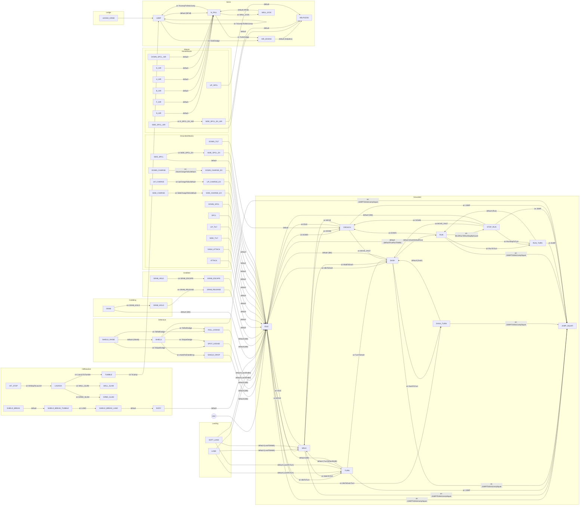

```mermaid
graph LR;
    START((start)) --> IDLE;

    subgraph Grounded
        IDLE -->|on MOVE| WALK;
        IDLE -->|on JUMP/ToStickJumpSquat| JUMP_SQUAT;
        IDLE -->|on DOWN| CROUCH;
        IDLE -->|on IdleToTurn| TURN;
        IDLE -->|on IdleToDash| DASH;
        IDLE -->|on IdleToDashTurn| DASH_TURN;

        WALK -->|on IDLE| IDLE;
        WALK -->|on JUMP/ToStickJumpSquat| JUMP_SQUAT;
        WALK -->|on DOWN| CROUCH;
        WALK -->|on WalkToTurn| TURN;
        WALK -->|on WalkToDash| DASH;

        TURN --"default (TurnDefaultWalk)"--> WALK;
        TURN --"default (Idle)"--> IDLE;
        TURN -->|on TurnToDash| DASH;
        TURN -->|on JUMP| JUMP_SQUAT;

        DASH -->|on JUMP/ToStickJumpSquat| JUMP_SQUAT;
        DASH -->|on DashToTurn| DASH_TURN;
        DASH --"default (DashDefaultRun)"--> RUN;
        DASH --"default (Idle)"--> IDLE;

        DASH_TURN --"default (Dash)"--> DASH;
        DASH_TURN -->|on JUMP/ToStickJumpSquat| JUMP_SQUAT;

        RUN -->|on JUMP/ToStickJumpSquat| JUMP_SQUAT;
        RUN -->|on IDLE/RunToRunStopByGuard| STOP_RUN;
        RUN -->|on DOWN| CROUCH;
        RUN -->|on RunToTurn| RUN_TURN;

        RUN_TURN --"default (defaultTrunRunToIdle)"--> IDLE;
        RUN_TURN --"default (Run)"--> RUN;
        RUN_TURN -->|on JUMP| JUMP_SQUAT;

        STOP_RUN -->|on MOVE_FAST| DASH;
        STOP_RUN -->|on JUMP| JUMP_SQUAT;
        STOP_RUN -->|on DOWN| CROUCH;
        STOP_RUN -->|on RunStopToTurn| RUN_TURN;
        STOP_RUN --"default (Idle)"--> IDLE;

        CROUCH -->|on IDLE| IDLE;
        CROUCH -->|on MOVE| WALK;
        CROUCH -->|on MOVE_FAST| DASH;
        CROUCH -->|on JUMP| JUMP_SQUAT;
    end

    subgraph Aerial
        JUMP --"default (NFall)"--> N_FALL;
        JUMP -->|on ToJump/ToStickJump| JUMP;
        JUMP -->|on ToAirDodge| AIR_DODGE;

        N_FALL -->|on ToJump/ToStickJump| JUMP;
        N_FALL -->|on ToAirDodge| AIR_DODGE;
        N_FALL -->|on WALL_KICK| WALL_KICK;

        AIR_DODGE --"default (Helpless)"--> HELPLESS;
        WALL_KICK --"default (NFall)"--> N_FALL;
    end

    subgraph Defensive
        SHIELD_RAISE --"default (Shield)"--> SHIELD;
        SHIELD_RAISE -->|on ToSpotDodge| SPOT_DODGE;
        SHIELD_RAISE -->|on ToRollDodge| ROLL_DODGE;

        SHIELD -->|on shieldToShieldDrop| SHIELD_DROP;
        SHIELD -->|on ToSpotDodge| SPOT_DODGE;
        SHIELD -->|on ToRollDodge| ROLL_DODGE;
        SHIELD -->|on JUMP/ToStickJumpSquat| JUMP_SQUAT;

        SHIELD_DROP --"default (Idle)"--> IDLE;
        SPOT_DODGE --"default (Idle)"--> IDLE;
        ROLL_DODGE --"default (Idle)"--> IDLE;
    end

    subgraph Landing
        LAND --"default (LandToIdle)"--> IDLE;
        LAND --"default (LandToWalk)"--> WALK;
        LAND --"default (LandToTurn)"--> TURN;
        SOFT_LAND --"default (LandToIdle)"--> IDLE;
        SOFT_LAND --"default (LandToWalk)"--> WALK;
        SOFT_LAND --"default (LandToTurn)"--> TURN;
    end

    subgraph Ledge
        LEDGE_GRAB --> JUMP;
    end

    subgraph HitReaction
        HIT_STOP -->|on HitStopToLaunch| LAUNCH;
        LAUNCH -->|on LaunchToTumble| TUMBLE;
        LAUNCH -->|on WALL_SLAM| WALL_SLAM;
        LAUNCH -->|on GRND_SLAM| GRND_SLAM;
        TUMBLE -->|on ToJump| JUMP;
        SHIELD_BREAK --"default"--> SHIELD_BREAK_TUMBLE;
        SHIELD_BREAK_TUMBLE -->|on LAND| SHIELD_BREAK_LAND;
        SHIELD_BREAK_LAND --"default"--> DIZZY;
        DIZZY --"default"--> IDLE;
    end

    subgraph Grabbing
        GRAB -->|on GRAB_HOLD| GRAB_HOLD;
        GRAB --"default (Idle)"--> IDLE;
    end

    subgraph Grabbed
        GRAB_HOLD -->|on GRAB_RELEASE| GRAB_RELEASE;
        GRAB_HELD -->|on GRAB_ESCAPE| GRAB_ESCAPE;
        GRAB_RELEASE --"default (Idle)"--> IDLE;
        GRAB_ESCAPE --"default (Idle)"--> IDLE;
    end

    subgraph Attacks
        subgraph GroundedAttacks
            ATTACK --"default"--> IDLE;
            DASH_ATTACK --"default"--> IDLE;
            DOWN_TILT --"default"--> CROUCH;
            SIDE_TILT --"default"--> IDLE;
            UP_TILT --"default"--> IDLE;
            SPCL --"default"--> IDLE;
            DOWN_SPCL --"default"--> IDLE;

            SIDE_CHARGE -->|on SideChargeToEx/default| SIDE_CHARGE_EX;
            SIDE_CHARGE_EX --"default"--> IDLE;
            UP_CHARGE -->|on UpChargeToEx/default| UP_CHARGE_EX;
            UP_CHARGE_EX --"default"--> IDLE;
            DOWN_CHARGE -->|on DownChargeToEx/default| DOWN_CHARGE_EX;
            DOWN_CHARGE_EX --"default"--> IDLE;

            SIDE_SPCL -->|on SIDE_SPCL_EX| SIDE_SPCL_EX;
            SIDE_SPCL --"default"--> IDLE;
            SIDE_SPCL_EX --"default"--> IDLE;
        end
        subgraph AerialAttacks
            N_AIR --"default"--> N_FALL;
            F_AIR --"default"--> N_FALL;
            B_AIR --"default"--> N_FALL;
            U_AIR --"default"--> N_FALL;
            D_AIR --"default"--> N_FALL;
            DOWN_SPCL_AIR --"default"--> N_FALL;

            SIDE_SPCL_AIR -->|on S_SPCL_EX_AIR| SIDE_SPCL_EX_AIR;
            SIDE_SPCL_AIR --"default"--> HELPLESS;
            SIDE_SPCL_EX_AIR --"default"--> HELPLESS;
            UP_SPCL --"default"--> HELPLESS;
        end
    end

    %% Top-level transitions are represented by the links between states in different subgraphs.
    %% For example, JUMP_SQUAT (in Grounded) transitions to JUMP (in Aerial).

    %% Universal Transitions (to HitReaction)
    %% Most states can transition to HIT_STOP on a HIT_STOP event.
    %% SHIELD can transition to SHIELD_BREAK.
    %% These are omitted for clarity but are defined in the state machine logic.

    %% Universal Transitions (to Grabbed)
    %% Most states can transition to GRAB_HELD on a GRAB_HELD event.
    %% These are also omitted for clarity.
```
